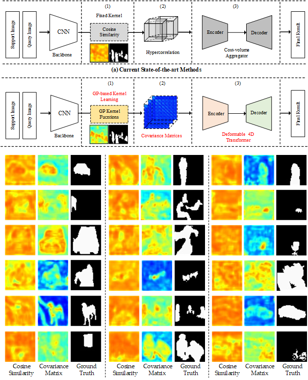

# Update

## uploading code

# DACM-Few-shot.pytorch
Code for Doubly deformable aggregation of covariance matrices for few-shot segmentation

    

Comparison of the proposed DACM (b) with the framework of existing state-of-the-art  methods  (a).  There  are  three  main  differences.  (1)  We  propose  to  utilizeGP-based kernel functions for similarity measurement. (2) We use covariance matricesinstead  of  cosine  similarity  as  the  cost  volume.  (3)  A  DDT  module  is  designed  foreffective cost volume aggregation.
